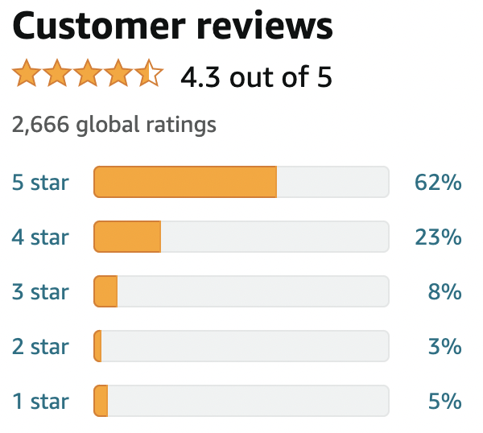

# [Object-Oriented Programming Review](https://redi-school.github.io/intermediate-java/oop-1-class-constructor/)

## Exercise

Let's create an e-commerce system. Think about a website like Amazon, where you can sell lots of different products :)

0. In the package `com.redi.j2`, create a class to represent a `Product`
0. Add the following private properties to the `Product`
    - `String name` the name of the product 
    - `String brand` the name of the product
    - `String category` the one category the product is assigned to (eg. "books", "electronics", "toys", etc.)
    - `float price` the unit price of this product
    - `List<String> tags` a list of labels that can be assigned to a product, (eg. "new", "discount", "free-delivery", etc.)
2. Add a constructor that receives the `name`, `brand`, `category` and `price`.
   - The constructor should initialize the tags as an empty List
   - There should not be any other constructors in this class
3. Implement getters for `name`, `brand`, `category` and `price`
4. Add the following behaviours to the `Product` class, which are based on the properties you created on step 1
   - `void setPrice(float newPrice)`: Changes the price of a Product. For obvious reasons, the price cannot be set to a negative value.
   - `void addTag(String tag)`: Adds a tag to the list. It should not allow duplicates.
   - `boolean hasTag(String tag)`: Return `true` if the product has this tag, `false` otherwise.
   - `void removeTag(String tag)`: Removes the given tag from the list (if exists).
   - `String toString()`: Returns a nice string representing all attributes from the product
5. Now create a new class in the package `com.redi.j2` called `ProductRepository`, which has these properties and behaviours:
   - `List<Product> products`: The private list of products, initialized by default to an empty list.
   - `ProductRepository()`: A no-args constructor.
   - `void addProduct(Product p)`: Adds a product to the ProductRepository. The method should not allow duplicates (a product with same `name` and `brand`).
   - `void removeProduct(Product p)`: Removes the specified product from the ProductRepository.
   - `Product getProductByName(String name)`: Searches for a product with the referred name and returns it. If not found, it returns `null`.
   - `List<Product> getProductsByCategory(String tag)`: Searches for all products from a specified category. Returns an empty list if no product matched the criteria.
6. Check if all the tests are passing before moving to the next step.
7. If all your tests are passing, from the `Main` class, implement the following logic:
   - Create an instance of the `ProductRepository` class
   - Create five instances of the `Product` class, each one with a representation of a different product you want to sell.
   - Add different tags to these products
   - Add these products to the ProductRepository
   - Use the ProductRepository instance to search for one of the products by name, then use the result to print the product information.
   - Use the ProductRepository instance to search for a list of matching products by a specific tag, then print them out.
8. (Challenge) Implement a rating mechanism like the "[Star Classification](https://en.wikipedia.org/wiki/Star_(classification))".
   - Use whatever private properties you think it will be necessary to implement all the following behaviours
   - `void addRating(int stars)`: Used for adding a rating from a customer. It receives a star rating from 0 to 5 (only).
   - `int getAmountRatings()`: Returns the total amount of ratings given to this product.
   - `int getAmountRatings(int stars)`: Returns the total amount of ratings of a specific star (eg. how many customers gave 4 stars for this product). The method should return 0 if an invalid rating is specified.
   - `float getAverageRating()`: Returns the average of all given ratings for the product. If there are no ratings, it should return -1.
   - Change the `toString` method to include now these new pieces of information (`amountRatings` and `averageRating`).
   - Change the `getProductsByCategory` method to return a list ordered by average ratings (the products with higher rating appear first in the result list).

## Example of Ratings System

